# 🏗️ ARCHITECTURE TECHNIQUE - BlockForge

## 📋 Table des Matières

1. [Vue d'ensemble](#vue-densemble)
2. [Stack Technique](#stack-technique)
3. [Architecture Front-End](#architecture-front-end)
4. [Structures de Données](#structures-de-données)
5. [Workflows Utilisateurs](#workflows-utilisateurs)
6. [Modules Détaillés](#modules-détaillés)
7. [Transition PixiJS → Three.js](#transition-pixijs--threejs)
8. [State Management](#state-management)
9. [UX/UI Design System](#uxui-design-system)
10. [Performance & Scalabilité](#performance--scalabilité)
11. [Roadmap MVP](#roadmap-mvp)

---

## 🎯 Vue d'ensemble

### Vision Produit

Un logiciel professionnel de construction modulaire permettant :

- **Designer** : Création et paramétrage de blocs réutilisables (dimensions, matériaux, propriétés)
- **Architecte** : Assemblage des blocs en plans complexes avec layers, snapping, alignements
- **Client** : Visualisation 3D immersive et export du plan final

### Philosophie Architecture

```
┌─────────────────────────────────────────────────────────────┐
│  MODULARITÉ + SCALABILITÉ + PERFORMANCE + UX PROFESSIONNELLE │
└─────────────────────────────────────────────────────────────┘
         │
         ├── Séparation stricte des rôles (Designer/Architecte/Client)
         ├── Modules indépendants et interchangeables
         ├── Progressive enhancement (2D → 3D)
         ├── State management centralisé
         └── UI dockable et personnalisable
```

---

## 🛠️ Stack Technique

### Core Framework

```typescript
{
  "framework": "React 18+",
  "language": "TypeScript 5+",
  "bundler": "Vite",
  "packageManager": "pnpm"
}
```

### Librairies Principales

#### Rendering Engines

```typescript
{
  "2D_Prototyping": "PixiJS 8.x",
  "3D_Production": "Three.js + React Three Fiber",
  "2D_Final": "Konva.js (alternative) ou PixiJS optimisé"
}
```

**Rationale PixiJS → Three.js :**

- **Phase 1 (Designer)** : PixiJS pour prototypage rapide 2D, édition flat XY/Z
- **Phase 2 (Architecte)** : Transition vers Three.js pour assembly 2D/3D hybride
- **Phase 3 (Client)** : Three.js full 3D avec camera controls avancés

#### State Management

```typescript
{
  "primary": "Zustand",
  "alternative": "Redux Toolkit",
  "reason": "Performance + devtools + simplicité"
}
```

#### UI Components

```typescript
{
  "componentLibrary": "Radix UI + shadcn/ui",
  "docking": "rc-dock ou react-mosaic",
  "dragAndDrop": "dnd-kit",
  "forms": "React Hook Form + Zod",
  "styling": "TailwindCSS + CSS Modules"
}
```

#### Utilities

```typescript
{
  "geometry": "mathjs + custom geometry utils",
  "snapping": "custom snap engine",
  "export": "Three.js exporters (GLTF, OBJ, STL)",
  "2D_export": "jsPDF + svg export",
  "collaboration": "Yjs (future)",
  "analytics": "Amplitude ou Mixpanel"
}
```

---

## 🏛️ Architecture Front-End

### Structure des Dossiers

```
src/
├── app/                          # Application core
│   ├── App.tsx
│   ├── Router.tsx
│   └── providers/                # Context providers
│       ├── AuthProvider.tsx
│       ├── ThemeProvider.tsx
│       └── WorkspaceProvider.tsx
│
├── pages/                        # Pages principales
│   ├── Dashboard/
│   │   ├── Dashboard.tsx
│   │   ├── ProjectGrid.tsx
│   │   └── RecentProjects.tsx
│   │
│   ├── Designer/                 # Mode Designer (PixiJS)
│   │   ├── DesignerWorkspace.tsx
│   │   ├── DesignerCanvas2D.tsx
│   │   ├── BlockEditor.tsx
│   │   └── PreviewPanel.tsx
│   │
│   ├── Architect/                # Mode Architecte (Three.js)
│   │   ├── ArchitectWorkspace.tsx
│   │   ├── ArchitectCanvas.tsx
│   │   ├── Assembly2DView.tsx
│   │   └── Assembly3DView.tsx
│   │
│   ├── Library/
│   │   ├── LibraryBrowser.tsx
│   │   ├── BlockGallery.tsx
│   │   └── CategoryFilters.tsx
│   │
│   ├── Client/                   # Vue client (read-only)
│   │   ├── ClientView.tsx
│   │   ├── Viewer3D.tsx
│   │   └── ExportOptions.tsx
│   │
│   └── Settings/
│       ├── SettingsPanel.tsx
│       ├── UserPreferences.tsx
│       └── WorkspaceConfig.tsx
│
├── modules/                      # Modules métier
│   ├── blocks/
│   │   ├── BlocksModule.ts       # CRUD blocs
│   │   ├── BlockValidator.ts
│   │   ├── BlockSerializer.ts
│   │   └── types.ts
│   │
│   ├── library/
│   │   ├── LibraryModule.ts
│   │   ├── CategoryManager.ts
│   │   └── SearchEngine.ts
│   │
│   ├── grid-snap/
│   │   ├── GridModule.ts
│   │   ├── SnapEngine.ts
│   │   ├── AlignmentHelpers.ts
│   │   └── MagnetSystem.ts
│   │
│   ├── layers/
│   │   ├── LayerModule.ts
│   │   ├── LayerManager.ts
│   │   └── VisibilityController.ts
│   │
│   ├── properties/
│   │   ├── PropertiesModule.ts
│   │   └── PropertyEditors/
│   │       ├── DimensionEditor.tsx
│   │       ├── MaterialEditor.tsx
│   │       └── ColorEditor.tsx
│   │
│   ├── export/
│   │   ├── ExportModule.ts
│   │   ├── exporters/
│   │   │   ├── GLTFExporter.ts
│   │   │   ├── PDFExporter.ts
│   │   │   └── ImageExporter.ts
│   │   └── templates/
│   │
│   ├── visualization/
│   │   ├── Visualization3D.ts
│   │   ├── CameraController.ts
│   │   └── LightingSystem.ts
│   │
│   └── collaboration/            # Future
│       ├── CollaborationModule.ts
│       └── SyncEngine.ts
│
├── components/                   # Composants réutilisables
│   ├── canvas/
│   │   ├── CanvasWrapper.tsx
│   │   ├── PixiCanvas.tsx
│   │   ├── ThreeCanvas.tsx
│   │   └── CanvasControls.tsx
│   │
│   ├── blocks/
│   │   ├── BlockComponent.tsx
│   │   ├── BlockPreview.tsx
│   │   └── BlockThumbnail.tsx
│   │
│   ├── panels/
│   │   ├── PropertiesPanel.tsx
│   │   ├── LayerPanel.tsx
│   │   ├── LibraryPanel.tsx
│   │   ├── HistoryPanel.tsx
│   │   └── SettingsPanel.tsx
│   │
│   ├── ui/                       # Design system
│   │   ├── Button/
│   │   ├── Input/
│   │   ├── Select/
│   │   ├── Slider/
│   │   ├── ColorPicker/
│   │   ├── Toolbar/
│   │   └── DockLayout/
│   │
│   └── common/
│       ├── Grid.tsx
│       ├── Ruler.tsx
│       ├── Minimap.tsx
│       └── ViewModeToggle.tsx
│
├── stores/                       # State management (Zustand)
│   ├── useProjectStore.ts        # Projet actif
│   ├── useBlocksStore.ts         # Blocs créés
│   ├── useLayersStore.ts         # Layers management
│   ├── useSelectionStore.ts      # Sélections
│   ├── useHistoryStore.ts        # Undo/Redo
│   ├── useUIStore.ts             # UI state (panels, theme)
│   └── useUserStore.ts           # User role, permissions
│
├── hooks/                        # Custom hooks
│   ├── useCanvas.ts
│   ├── useSelection.ts
│   ├── useSnap.ts
│   ├── useKeyboard.ts
│   ├── useViewport.ts
│   └── useExport.ts
│
├── utils/                        # Utilitaires
│   ├── geometry/
│   │   ├── transforms.ts
│   │   ├── intersection.ts
│   │   └── bounds.ts
│   │
│   ├── converters/
│   │   ├── pixiToThree.ts        # Conversion clé
│   │   └── blockSerializer.ts
│   │
│   └── constants/
│       ├── colors.ts
│       ├── materials.ts
│       └── gridConfig.ts
│
└── types/                        # Types TypeScript
    ├── block.types.ts
    ├── layer.types.ts
    ├── project.types.ts
    └── user.types.ts
```

---

## 📊 Structures de Données

### 1. Block (Designer)

```typescript
interface Block {
  id: string; // UUID
  name: string;
  description?: string;

  // Géométrie
  geometry: {
    type: "box" | "cylinder" | "custom";
    dimensions: {
      width: number; // X
      height: number; // Y
      depth: number; // Z
    };
    vertices?: Vector3[]; // Pour custom shapes
    faces?: Face[];
  };

  // Visuel
  appearance: {
    color: string; // Hex color
    texture?: {
      id: string;
      url: string;
      scale: [number, number];
    };
    material: MaterialType; // 'plastic' | 'wood' | 'metal' | 'glass'
    opacity: number; // 0-1
  };

  // Métadonnées
  metadata: {
    category: string; // 'wall' | 'floor' | 'furniture' | 'door'
    tags: string[];
    createdBy: string; // User ID
    createdAt: Date;
    updatedAt: Date;
    version: number;
  };

  // Connection points (snap points)
  snapPoints: SnapPoint[];

  // Properties custom
  customProperties: Record<string, any>;

  // 2D representation (PixiJS)
  pixi: {
    sprite?: string; // URL sprite 2D
    graphics?: PixiGraphicsData;
  };

  // 3D representation (Three.js)
  three?: {
    geometry: BufferGeometry;
    material: Material;
  };
}

interface SnapPoint {
  id: string;
  position: Vector3; // Position relative au block
  normal: Vector3; // Direction de snap
  type: "edge" | "corner" | "center" | "custom";
  enabled: boolean;
}

type MaterialType =
  | "plastic"
  | "wood"
  | "metal"
  | "glass"
  | "concrete"
  | "fabric";

interface Vector3 {
  x: number;
  y: number;
  z: number;
}
```

### 2. Project (Architecte)

```typescript
interface Project {
  id: string;
  name: string;
  description?: string;

  // Métadonnées
  metadata: {
    createdBy: string;
    createdAt: Date;
    updatedAt: Date;
    version: number;
    thumbnail?: string;
  };

  // Configuration
  config: {
    gridSize: number; // Taille de la grille en unités
    snapTolerance: number; // Distance de snap
    units: "metric" | "imperial";
    defaultLayer: string;
  };

  // Layers
  layers: Layer[];

  // Instances de blocs placés
  instances: BlockInstance[];

  // Caméra et viewport
  viewport: {
    position: Vector3;
    rotation: Vector3;
    zoom: number;
    mode: "2D" | "3D" | "hybrid";
  };

  // Historique (undo/redo)
  history: HistoryEntry[];
  historyIndex: number;
}

interface Layer {
  id: string;
  name: string;
  visible: boolean;
  locked: boolean;
  opacity: number;
  color: string; // Couleur de highlight
  order: number; // Z-index
  parent?: string; // Pour nested layers
  children: string[];
}

interface BlockInstance {
  id: string; // Instance ID (différent du Block ID)
  blockId: string; // Référence au Block template

  // Transform
  transform: {
    position: Vector3;
    rotation: Vector3; // Euler angles
    scale: Vector3;
  };

  // Layer
  layerId: string;

  // État
  state: {
    selected: boolean;
    locked: boolean;
    visible: boolean;
  };

  // Overrides (propriétés custom pour cette instance)
  overrides?: {
    color?: string;
    material?: MaterialType;
    customProperties?: Record<string, any>;
  };

  // Connections avec autres instances
  connections: Connection[];
}

interface Connection {
  targetInstanceId: string;
  sourceSnapPointId: string;
  targetSnapPointId: string;
  locked: boolean;
}

interface HistoryEntry {
  id: string;
  timestamp: Date;
  action: ActionType;
  data: any; // Snapshot des données modifiées
  userId: string;
}

type ActionType =
  | "add_instance"
  | "remove_instance"
  | "move_instance"
  | "rotate_instance"
  | "scale_instance"
  | "modify_properties"
  | "add_layer"
  | "remove_layer"
  | "modify_layer";
```

### 3. Library

```typescript
interface Library {
  id: string;
  name: string;

  // Categories
  categories: Category[];

  // Blocs disponibles
  blocks: Block[];

  // Configuration
  config: {
    sortBy: "name" | "date" | "usage";
    viewMode: "grid" | "list";
    filters: LibraryFilters;
  };
}

interface Category {
  id: string;
  name: string;
  icon?: string;
  parent?: string;
  children: string[];
  blockIds: string[];
}

interface LibraryFilters {
  categories: string[];
  tags: string[];
  materials: MaterialType[];
  searchQuery: string;
}
```

### 4. User & Roles

```typescript
interface User {
  id: string;
  name: string;
  email: string;
  role: UserRole;
  permissions: Permission[];
  preferences: UserPreferences;
}

type UserRole = "designer" | "architect" | "client" | "admin";

interface Permission {
  resource: "blocks" | "projects" | "library" | "settings";
  actions: ("create" | "read" | "update" | "delete")[];
}

interface UserPreferences {
  theme: "light" | "dark";
  language: string;
  gridVisible: boolean;
  snapEnabled: boolean;
  panelLayout: PanelLayout;
  shortcuts: Record<string, string>;
}

interface PanelLayout {
  panels: {
    id: string;
    position: "left" | "right" | "top" | "bottom" | "floating";
    size: number; // Width ou height en pixels
    visible: boolean;
  }[];
}
```

### 5. Export Data

```typescript
interface ExportConfig {
  format: ExportFormat;
  options: ExportOptions;
}

type ExportFormat =
  | "3D_GLTF"
  | "3D_OBJ"
  | "3D_STL"
  | "2D_PDF"
  | "2D_SVG"
  | "2D_PNG"
  | "JSON";

interface ExportOptions {
  // 3D options
  includeTextures?: boolean;
  includeMaterials?: boolean;
  optimize?: boolean;
  scale?: number;

  // 2D options
  resolution?: number; // DPI
  dimensions?: { width: number; height: number };
  layers?: string[]; // Layers à exporter
  viewAngle?: "top" | "front" | "side" | "isometric";

  // Metadata
  includeMetadata?: boolean;
  watermark?: string;
}
```

---

## 👥 Workflows Utilisateurs

### Workflow 1 : Designer → Création de Bloc

```mermaid
graph TD
    A[Dashboard] --> B[Mode Designer]
    B --> C[Nouveau Bloc]
    C --> D[Éditeur 2D PixiJS]
    D --> E[Définir Dimensions X/Y/Z]
    E --> F[Choisir Couleur/Texture/Matériau]
    F --> G[Placer Snap Points]
    G --> H[Preview 3D]
    H --> I{Valider?}
    I -->|Oui| J[Sauvegarder dans Library]
    I -->|Non| D
    J --> K[Bloc disponible pour Architecte]
```



**Étapes détaillées :**

1. **Accès Dashboard**

   - Utilisateur avec rôle "Designer" se connecte
   - Vue des projets récents + bouton "Créer un Bloc"

2. **Mode Designer**

   - Workspace dédié avec canvas PixiJS 2D
   - Panels : Properties, Preview 3D, Library (read-only)
   - Toolbar : outils de dessin (rectangle, cercle, polygon, path)

3. **Création Géométrie**

   - Dessiner shape 2D en vue XY
   - Inputs numériques pour dimensions précises
   - Basculer vue XZ ou YZ pour définir profondeur/hauteur
   - Système de snap automatique aux grilles

4. **Paramétrage Visuel**

   - Properties Panel : color picker, material selector, texture upload
   - Preview en temps réel sur canvas 2D
   - Bouton "Preview 3D" → modal avec Three.js preview

5. **Snap Points**

   - Mode "Edit Snap Points"
   - Cliquer sur edges/corners pour placer points
   - Définir normal direction avec arrow tool
   - Types : automatic (edge/corner) ou custom

6. **Validation & Save**
   - Bouton "Save to Library"
   - Modal : nom, description, category, tags
   - Validation schema (dimensions > 0, snap points valides)
   - Sauvegarde en DB + génération thumbnail

---

### Workflow 2 : Architecte → Assembly Plan

```mermaid
graph TD
    A[Dashboard] --> B[Nouveau Projet]
    B --> C[Mode Architecte]
    C --> D[Ouvrir Library]
    D --> E[Drag & Drop Bloc sur Canvas]
    E --> F[Placement avec Snap]
    F --> G[Rotation/Scale]
    G --> H[Organiser Layers]
    H --> I{Ajouter plus de blocs?}
    I -->|Oui| D
    I -->|Non| J[Basculer Vue 3D]
    J --> K[Vérification Assemblage]
    K --> L[Export ou Partage Client]
```



**Étapes détaillées :**

1. **Création Projet**

   - Dashboard → "Nouveau Projet"
   - Config initiale : nom, units (metric/imperial), grid size
   - Création layers par défaut : "Ground", "Walls", "Roof"

2. **Workspace Architecte**

   - Canvas Three.js en mode 2D (vue top-down orthographique)
   - Panels : Library, Layers, Properties, History
   - Toolbar : Select, Move, Rotate, Scale, Multi-select

3. **Placement Blocs**

   - Library Panel → parcourir categories
   - Drag bloc depuis library → hover canvas
   - Preview fantôme avec outline
   - Snap automatique aux autres blocs (magnets verts)
   - Click pour placer

4. **Manipulation**

   - Select tool : click pour sélectionner, shift+click multi-select
   - Move : drag avec snap to grid ou snap to blocks
   - Rotate : handle circulaire, snap angles 15°/45°/90°
   - Scale : handles sur bounding box (uniformément ou par axe)

5. **Layer Management**

   - Layer Panel : toggle visibility, lock, opacity
   - Drag instances entre layers
   - Create nested layers (ex: "Walls" > "Interior" > "Kitchen")
   - Color coding pour identification visuelle

6. **Vue 3D**

   - Toggle button "2D/3D"
   - Transition smooth du canvas
   - Camera controls : orbit, pan, zoom
   - Lighting automatique (sun + ambient)

7. **Collaboration** (future)
   - Multi-cursors en temps réel
   - Change notifications
   - Lock instances en cours d'édition

---

### Workflow 3 : Client → Visualisation & Export


**Étapes détaillées :**

1. **Accès Client**

   - Architecte partage lien public ou privé (avec password)
   - Pas de login requis (ou login light)
   - Mode read-only strict

2. **Viewer 3D**

   - Canvas Three.js full 3D
   - Controls : orbit (mouse), pan (right-click), zoom (scroll)
   - Boutons prédéfinis : "Top View", "Front", "Side", "Isometric"
   - Fullscreen mode

3. **Navigation Avancée**

   - Minimap 2D en corner
   - Section planes (couper le modèle en X/Y/Z)
   - Exploded view (écarter les blocs pour voir structure)
   - Walkthrough mode (first-person camera)

4. **Layers Control**

   - Layer Panel (simplifié)
   - Toggle visibility pour isoler parties
   - Pas de modification possible

5. **Mesures**

   - Tool "Measure" : click 2 points → affiche distance
   - Tool "Area" : dessiner polygon → affiche surface
   - Annotations : placer pins avec texte custom

6. **Feedback** (optionnel)

   - Bouton "Add Comment"
   - Click sur bloc → modal commentaire
   - Sauvegardé et visible pour Architecte

7. **Export**
   - Bouton "Export"
   - Formats disponibles : PDF (2D plans), PNG (renders), GLTF (3D model)
   - Options : resolution, views, layers
   - Download direct ou email

---

## 🧩 Modules Détaillés

### Module 1 : Blocks Module

**Responsabilités :**

- CRUD opérations sur blocs
- Validation des propriétés
- Gestion des versions
- Serialization/Deserialization

**API :**

```typescript
class BlocksModule {
  // CRUD
  createBlock(data: Partial<Block>): Block;
  getBlock(id: string): Block | null;
  updateBlock(id: string, data: Partial<Block>): Block;
  deleteBlock(id: string): boolean;

  // Validation
  validateBlock(block: Block): ValidationResult;

  // Conversion
  toPixiGraphics(block: Block): PixiGraphicsData;
  toThreeGeometry(block: Block): BufferGeometry;

  // Serialization
  serialize(block: Block): string;
  deserialize(data: string): Block;

  // Versioning
  getVersionHistory(blockId: string): BlockVersion[];
  revertToVersion(blockId: string, version: number): Block;
}
```

**Intégration :**

- Store : `useBlocksStore`
- Utilisé par : Designer Workspace, Library, Architect Workspace
- Events : `block:created`, `block:updated`, `block:deleted`

---

### Module 2 : Library Module

**Responsabilités :**

- Gestion des catégories
- Recherche et filtres
- Import/Export de libraries
- Thumbnails generation

**API :**

```typescript
class LibraryModule {
  // Categories
  createCategory(data: Partial<Category>): Category;
  getCategories(): Category[];

  // Search
  searchBlocks(query: string, filters: LibraryFilters): Block[];

  // Management
  addBlockToLibrary(blockId: string, categoryId: string): void;
  removeBlockFromLibrary(blockId: string): void;

  // Import/Export
  exportLibrary(categoryIds?: string[]): LibraryExport;
  importLibrary(data: LibraryExport): ImportResult;

  // Thumbnails
  generateThumbnail(blockId: string): Promise<string>;
}
```

**Features :**

- Fuzzy search avec Fuse.js
- Drag & drop de blocs vers canvas
- Preview hover (tooltip 3D mini)
- Favorite blocks (star system)
- Usage analytics (most used blocks)

---

### Module 3 : Grid & Snap Module

**Responsabilités :**

- Affichage grille dynamique
- Snap to grid
- Snap to blocks (magnetic snap points)
- Alignment guides (smart guides type Figma)

**API :**

```typescript
class GridSnapModule {
  // Grid
  setGridSize(size: number): void;
  toggleGridVisibility(visible: boolean): void;

  // Snap to grid
  snapToGrid(position: Vector3): Vector3;

  // Snap to blocks
  findNearbySnapPoints(position: Vector3, tolerance: number): SnapPoint[];
  snapToPoint(position: Vector3, snapPoint: SnapPoint): Vector3;

  // Alignment
  findAlignmentGuides(selectedInstances: BlockInstance[]): AlignmentGuide[];
  alignInstances(instances: BlockInstance[], type: AlignType): void;
}

type AlignType =
  | "left"
  | "center"
  | "right"
  | "top"
  | "middle"
  | "bottom"
  | "distribute-horizontal"
  | "distribute-vertical";

interface AlignmentGuide {
  axis: "x" | "y" | "z";
  position: number;
  instances: string[]; // IDs des instances alignées
  type: "edge" | "center";
}
```

**Visuel :**

- Grille adaptative (zoom → subdivision)
- Snap points verts quand proche (< tolerance)
- Alignment guides rouges type Figma
- Magnetic feedback (subtle animation)

---

### Module 4 : Layer Module

**Responsabilités :**

- CRUD layers
- Visibility & lock management
- Nested layers
- Bulk operations

**API :**

```typescript
class LayerModule {
  // CRUD
  createLayer(data: Partial<Layer>): Layer;
  getLayer(id: string): Layer | null;
  updateLayer(id: string, data: Partial<Layer>): Layer;
  deleteLayer(id: string): boolean;

  // Hierarchy
  setParent(layerId: string, parentId: string | null): void;
  reorderLayers(layerIds: string[]): void;

  // Visibility
  toggleVisibility(layerId: string, recursive?: boolean): void;
  setOpacity(layerId: string, opacity: number): void;

  // Lock
  toggleLock(layerId: string, recursive?: boolean): void;

  // Bulk operations
  moveInstancesToLayer(instanceIds: string[], layerId: string): void;
  getInstancesByLayer(layerId: string): BlockInstance[];
}
```

**UI :**

- Tree view avec expand/collapse
- Drag & drop pour réorganiser
- Eye icon (visibility), lock icon
- Color badge pour identification
- Right-click context menu

---

### Module 5 : Export Module

**Responsabilités :**

- Export 3D (GLTF, OBJ, STL)
- Export 2D (PDF, SVG, PNG)
- Export JSON (data structure)
- Templates de mise en page

**API :**

```typescript
class ExportModule {
  // 3D Export
  exportGLTF(project: Project, options: ExportOptions): Promise<Blob>;
  exportOBJ(project: Project, options: ExportOptions): Promise<Blob>;
  exportSTL(project: Project, options: ExportOptions): Promise<Blob>;

  // 2D Export
  exportPDF(project: Project, options: ExportOptions): Promise<Blob>;
  exportSVG(project: Project, options: ExportOptions): Promise<string>;
  exportPNG(project: Project, options: ExportOptions): Promise<Blob>;

  // Data
  exportJSON(project: Project): string;

  // Templates
  getTemplates(): ExportTemplate[];
  applyTemplate(project: Project, templateId: string): RenderResult;
}

interface ExportTemplate {
  id: string;
  name: string;
  type: "2D" | "3D";
  layout: LayoutConfig; // Multi-views, legends, title blocks
  previewUrl: string;
}
```

**Features :**

- Progress bar pour gros exports
- Preview avant export
- Batch export (multiple formats)
- Email delivery (optionnel)

---

## 🔄 Transition PixiJS → Three.js

### Stratégie de Transition

```
┌─────────────────────────────────────────────────────┐
│                   PHASE 1 : DESIGNER                │
│                     (PixiJS 2D)                     │
└─────────────────────────────────────────────────────┘
                          │
                          │ Serialization
                          ▼
                  [Block Data Structure]
                          │
                          │ Conversion
                          ▼
┌─────────────────────────────────────────────────────┐
│                  PHASE 2 : ARCHITECTE               │
│              (Three.js 2D/3D Hybrid)                │
└─────────────────────────────────────────────────────┘
                          │
                          │ Enrichment
                          ▼
┌─────────────────────────────────────────────────────┐
│                   PHASE 3 : CLIENT                  │
│                  (Three.js 3D Full)                 │
└─────────────────────────────────────────────────────┘
```

### Conversion Pipeline

```typescript
// Converter : PixiJS → Three.js
class PixiToThreeConverter {
  convert(block: Block): Three.Object3D {
    const geometry = this.convertGeometry(block);
    const material = this.convertMaterial(block);
    const mesh = new Three.Mesh(geometry, material);

    // Transfer properties
    mesh.userData = {
      blockId: block.id,
      snapPoints: block.snapPoints,
      customProperties: block.customProperties,
    };

    return mesh;
  }

  private convertGeometry(block: Block): Three.BufferGeometry {
    const { type, dimensions } = block.geometry;

    switch (type) {
      case "box":
        return new Three.BoxGeometry(
          dimensions.width,
          dimensions.height,
          dimensions.depth
        );

      case "cylinder":
        return new Three.CylinderGeometry(
          dimensions.width / 2,
          dimensions.width / 2,
          dimensions.height
        );

      case "custom":
        // Extrude PixiJS path vers 3D
        return this.extrudePixiPath(block.pixi.graphics, dimensions.depth);
    }
  }

  private convertMaterial(block: Block): Three.Material {
    const { color, texture, material, opacity } = block.appearance;

    const materialMap = {
      plastic: () =>
        new Three.MeshStandardMaterial({
          color,
          opacity,
          transparent: opacity < 1,
          roughness: 0.5,
          metalness: 0.1,
        }),

      wood: () =>
        new Three.MeshStandardMaterial({
          color,
          map: texture ? textureLoader.load(texture.url) : null,
          roughness: 0.8,
          metalness: 0.0,
        }),

      metal: () =>
        new Three.MeshStandardMaterial({
          color,
          roughness: 0.2,
          metalness: 0.9,
        }),

      glass: () =>
        new Three.MeshPhysicalMaterial({
          color,
          opacity: 0.3,
          transparent: true,
          roughness: 0.0,
          metalness: 0.1,
          transmission: 0.9,
        }),
    };

    return materialMap[material]();
  }

  private extrudePixiPath(
    graphics: PixiGraphicsData,
    depth: number
  ): Three.BufferGeometry {
    // Convert PixiJS path to Three.js Shape
    const shape = new Three.Shape();

    // Parse PixiJS graphics commands
    graphics.commands.forEach((cmd) => {
      switch (cmd.type) {
        case "moveTo":
          shape.moveTo(cmd.x, cmd.y);
          break;
        case "lineTo":
          shape.lineTo(cmd.x, cmd.y);
          break;
        case "bezierCurveTo":
          shape.bezierCurveTo(
            cmd.cp1x,
            cmd.cp1y,
            cmd.cp2x,
            cmd.cp2y,
            cmd.x,
            cmd.y
          );
          break;
      }
    });

    // Extrude to 3D
    const extrudeSettings = {
      depth,
      bevelEnabled: false,
    };

    return new Three.ExtrudeGeometry(shape, extrudeSettings);
  }
}
```

### Gestion des Contextes Multiples

```typescript
// Canvas Manager : gère PixiJS et Three.js
class CanvasManager {
  private pixiApp: PIXI.Application | null = null;
  private threeScene: Three.Scene | null = null;
  private threeRenderer: Three.WebGLRenderer | null = null;

  initPixi(container: HTMLElement): void {
    this.pixiApp = new PIXI.Application({
      width: container.clientWidth,
      height: container.clientHeight,
      backgroundColor: 0xf5f5f5,
      antialias: true,
    });

    container.appendChild(this.pixiApp.view);
  }

  initThree(container: HTMLElement): void {
    this.threeScene = new Three.Scene();
    this.threeRenderer = new Three.WebGLRenderer({ antialias: true });
    this.threeRenderer.setSize(container.clientWidth, container.clientHeight);

    container.appendChild(this.threeRenderer.domElement);
  }

  switchMode(mode: "pixi" | "three"): void {
    if (mode === "pixi" && this.pixiApp) {
      this.pixiApp.view.style.display = "block";
      if (this.threeRenderer) {
        this.threeRenderer.domElement.style.display = "none";
      }
    } else if (mode === "three" && this.threeRenderer) {
      this.threeRenderer.domElement.style.display = "block";
      if (this.pixiApp) {
        this.pixiApp.view.style.display = "none";
      }
    }
  }

  cleanup(): void {
    if (this.pixiApp) {
      this.pixiApp.destroy(true);
    }
    if (this.threeRenderer) {
      this.threeRenderer.dispose();
    }
  }
}
```

---

## 🗄️ State Management

### Architecture Zustand

```typescript
// Store 1 : Project Store
interface ProjectStore {
  // State
  currentProject: Project | null;
  projects: Project[];

  // Actions
  createProject: (data: Partial<Project>) => void;
  loadProject: (id: string) => Promise<void>;
  saveProject: () => Promise<void>;
  updateProjectConfig: (config: Partial<Project["config"]>) => void;

  // Viewport
  setViewport: (viewport: Partial<Project["viewport"]>) => void;
  toggleViewMode: () => void;
}

// Store 2 : Blocks Store
interface BlocksStore {
  blocks: Record<string, Block>;

  addBlock: (block: Block) => void;
  updateBlock: (id: string, data: Partial<Block>) => void;
  removeBlock: (id: string) => void;
  getBlock: (id: string) => Block | undefined;
}

// Store 3 : Instances Store (Architecte)
interface InstancesStore {
  instances: Record<string, BlockInstance>;

  addInstance: (instance: BlockInstance) => void;
  removeInstance: (id: string) => void;
  updateTransform: (id: string, transform: Partial<Transform>) => void;
  setInstanceLayer: (id: string, layerId: string) => void;

  // Bulk operations
  duplicateInstances: (ids: string[]) => void;
  deleteInstances: (ids: string[]) => void;
}

// Store 4 : Selection Store
interface SelectionStore {
  selectedIds: string[];

  select: (id: string, multi?: boolean) => void;
  deselect: (id: string) => void;
  clearSelection: () => void;
  selectAll: () => void;

  // Computed
  selectedInstances: () => BlockInstance[];
  selectionBounds: () => BoundingBox;
}

// Store 5 : Layers Store
interface LayersStore {
  layers: Record<string, Layer>;
  activeLayerId: string;

  createLayer: (data: Partial<Layer>) => void;
  updateLayer: (id: string, data: Partial<Layer>) => void;
  deleteLayer: (id: string) => void;
  setActiveLayer: (id: string) => void;
  reorderLayers: (order: string[]) => void;
}

// Store 6 : History Store (Undo/Redo)
interface HistoryStore {
  past: HistoryEntry[];
  future: HistoryEntry[];

  pushState: (entry: HistoryEntry) => void;
  undo: () => void;
  redo: () => void;
  canUndo: () => boolean;
  canRedo: () => boolean;
}

// Store 7 : UI Store
interface UIStore {
  theme: "light" | "dark";
  panelLayout: PanelLayout;
  gridVisible: boolean;
  snapEnabled: boolean;

  toggleTheme: () => void;
  setPanelVisibility: (panelId: string, visible: boolean) => void;
  setPanelSize: (panelId: string, size: number) => void;
  toggleGrid: () => void;
  toggleSnap: () => void;
}
```

### Synchronisation Stores

```typescript
// Middleware pour sync entre stores
const syncMiddleware = (config) => (set, get, api) => {
  // Subscribe aux changements
  api.subscribe((state, prevState) => {
    // Ex: quand selection change, update UI
    if (state.selectedIds !== prevState.selectedIds) {
      useUIStore.getState().updatePropertiesPanel(state.selectedIds);
    }

    // Ex: quand instances change, push history
    if (state.instances !== prevState.instances) {
      useHistoryStore.getState().pushState({
        id: nanoid(),
        timestamp: new Date(),
        action: "modify_instances",
        data: state.instances,
      });
    }
  });

  return config(set, get, api);
};
```

---

## 🎨 UX/UI Design System

### Principes Design

1. **Professional & Clean**

   - Inspiré de Figma (minimalist) + AutoCAD (functional)
   - Panels dockable et flottants
   - Dark mode par défaut (moins fatigue visuelle)

2. **Contextual Tools**

   - Toolbar change selon mode (Designer vs Architecte)
   - Properties Panel adapte selon sélection
   - Shortcuts intelligents (context-aware)

3. **Visual Feedback**

   - Toutes actions ont feedback visuel
   - Hover states, active states, disabled states
   - Loading states et progress indicators

4. **Keyboard First**
   - Tous outils accessibles au clavier
   - Shortcuts customisables
   - Vim-like navigation (optionnel)

### Layout Architecture

```
┌────────────────────────────────────────────────────────────┐
│  TOPBAR (Global)                                           │
│  [Logo] [Project Name] [Role Badge] [...] [User Avatar]   │
├────────┬──────────────────────────────────────┬────────────┤
│        │                                      │            │
│ LEFT   │         CANVAS                       │   RIGHT    │
│ PANEL  │    (PixiJS ou Three.js)              │   PANEL    │
│        │                                      │            │
│ - Lib  │                                      │ - Props    │
│ - Layers│                                     │ - History  │
│        │                                      │            │
├────────┴──────────────────────────────────────┴────────────┤
│  BOTTOM BAR                                                │
│  [Zoom: 100%] [Grid: ON] [Snap: ON] [Coords: X:0 Y:0]     │
└────────────────────────────────────────────────────────────┘
```

### Panels Système

**1. Library Panel**

```
┌─────────────────────┐
│ 🔍 Search blocks    │
├─────────────────────┤
│ 📁 Categories       │
│   ▼ Walls           │
│     - Interior      │
│     - Exterior      │
│   ▶ Floors          │
│   ▶ Furniture       │
├─────────────────────┤
│ [Grid View]         │
│ ┌───┐ ┌───┐ ┌───┐  │
│ │ █ │ │ █ │ │ █ │  │
│ └───┘ └───┘ └───┘  │
│  Wall  Door Window  │
└─────────────────────┘
```

**2. Properties Panel**

```
┌─────────────────────┐
│ Block Properties    │
├─────────────────────┤
│ Transform           │
│ X: [    0.00  ]     │
│ Y: [    0.00  ]     │
│ Z: [    0.00  ]     │
│                     │
│ Rotation            │
│ [    0°    ] 🔄     │
│                     │
│ Dimensions          │
│ W: [  100.00 ]      │
│ H: [   50.00 ]      │
│ D: [   20.00 ]      │
│                     │
│ Appearance          │
│ Color: [■] #3498db  │
│ Material: [Plastic▼]│
│ Opacity: [████░] 80%│
└─────────────────────┘
```

**3. Layers Panel**

```
┌─────────────────────┐
│ Layers         [+]  │
├─────────────────────┤
│ 👁 🔒 ■ Ground      │
│ 👁 🔒 ■ Walls       │
│   ▼                 │
│   👁 🔓 ■ Interior  │
│   👁 🔓 ■ Exterior  │
│ 👁 🔒 ■ Roof        │
│ 👁 🔓 ■ Furniture   │
└─────────────────────┘
```

**4. Toolbar (Architecte)**

```
┌──────────────────────────────────────────┐
│ [↖] [↔] [↻] [⊡] │ [⊕] [⊖] │ [⟷] [⟱] │ [◧] │
│ Sel  Move Rot Scale Add Del  Align Snap  │
└──────────────────────────────────────────┘
```

### Shortcuts Essentiels

```typescript
const SHORTCUTS = {
  // Tools
  V: "select_tool",
  M: "move_tool",
  R: "rotate_tool",
  S: "scale_tool",

  // Actions
  "Cmd+C": "copy",
  "Cmd+V": "paste",
  "Cmd+D": "duplicate",
  Delete: "delete",
  "Cmd+Z": "undo",
  "Cmd+Shift+Z": "redo",

  // View
  "Space+Drag": "pan_canvas",
  "Cmd+Scroll": "zoom",
  "1": "view_top",
  "2": "view_front",
  "3": "view_side",
  "0": "view_3d",

  // UI
  "Cmd+\\": "toggle_panels",
  G: "toggle_grid",
  "Cmd+;": "toggle_snap",

  // Multi-select
  "Shift+Click": "add_to_selection",
  "Cmd+A": "select_all",
  "Cmd+Shift+A": "deselect_all",

  // Layers
  "Cmd+Shift+N": "new_layer",
  "Cmd+]": "move_layer_up",
  "Cmd+[": "move_layer_down",
};
```

### Dark Mode Theme

```typescript
const THEME = {
  dark: {
    // Backgrounds
    bg: {
      primary: "#1e1e1e",
      secondary: "#2d2d2d",
      tertiary: "#3d3d3d",
      canvas: "#252525",
    },

    // Text
    text: {
      primary: "#e0e0e0",
      secondary: "#a0a0a0",
      disabled: "#606060",
    },

    // Borders
    border: {
      default: "#404040",
      focus: "#0078d4",
      hover: "#505050",
    },

    // Accent
    accent: {
      primary: "#0078d4",
      success: "#10b981",
      warning: "#f59e0b",
      error: "#ef4444",
    },

    // Canvas
    canvas: {
      grid: "#333333",
      snap: "#10b981",
      selection: "#0078d4",
      hover: "#60a5fa",
    },
  },

  light: {
    // Backgrounds
    bg: {
      primary: "#ffffff",
      secondary: "#f5f5f5",
      tertiary: "#e5e5e5",
      canvas: "#fafafa",
    },

    // Text
    text: {
      primary: "#1a1a1a",
      secondary: "#6b7280",
      disabled: "#d1d5db",
    },

    // Borders
    border: {
      default: "#e5e7eb",
      focus: "#3b82f6",
      hover: "#d1d5db",
    },

    // Accent
    accent: {
      primary: "#3b82f6",
      success: "#10b981",
      warning: "#f59e0b",
      error: "#ef4444",
    },

    // Canvas
    canvas: {
      grid: "#e5e7eb",
      snap: "#10b981",
      selection: "#3b82f6",
      hover: "#60a5fa",
    },
  },
};
```

---

## ⚡ Performance & Scalabilité

### Optimisations Clés

**1. Canvas Rendering**

```typescript
// PixiJS optimizations
- Use sprite batching for repeated blocks
- Object pooling pour instances
- Culling : ne render que visible viewport
- LOD (Level of Detail) : simplify distant blocks

// Three.js optimizations
- InstancedMesh pour blocks identiques
- Frustum culling automatique
- Geometry merging pour static elements
- Texture atlasing pour materials
```

**2. State Management**

```typescript
// Zustand optimizations
- Shallow selectors pour éviter re-renders
- Immer pour immutable updates
- Sliced stores (éviter mega-store)
- Persist middleware avec debounce
```

**3. Data Structures**

```typescript
// Spatial indexing
class SpatialIndex {
  private quadtree: Quadtree;

  // Fast neighbor search pour snapping
  findNearby(position: Vector3, radius: number): BlockInstance[];

  // Fast collision detection
  detectCollisions(bounds: BoundingBox): BlockInstance[];
}

// LRU Cache pour blocks
class BlockCache {
  private cache: LRUCache<string, Block>;
  maxSize: number = 1000;

  get(id: string): Block | undefined;
  set(id: string, block: Block): void;
}
```

**4. Lazy Loading**

```typescript
// Code splitting par route
const Designer = lazy(() => import("./pages/Designer"));
const Architect = lazy(() => import("./pages/Architect"));

// Lazy load modules
const Physics = lazy(() => import("./modules/physics"));

// Progressive library loading
const loadLibraryChunk = (categoryId: string) => {
  return api.getBlocks({ category: categoryId, limit: 50 });
};
```

### Scalabilité

**Métriques Cibles :**

```
- Max blocks in library: 10,000+
- Max instances in project: 5,000+
- Canvas FPS: 60fps stable (2D), 30fps (3D)
- Time to load project: < 2s
- Time to save project: < 1s
- Export time (GLTF): < 5s for 1000 instances
```

**Scaling Strategies :**

```typescript
// 1. Virtual scrolling pour library
<VirtualList
  items={blocks}
  itemHeight={120}
  windowHeight={600}
/>

// 2. Pagination API
GET /api/blocks?page=1&limit=50

// 3. WebWorkers pour heavy operations
const worker = new Worker('converter.worker.ts');
worker.postMessage({ blocks: selectedBlocks, action: 'export' });

// 4. IndexedDB pour cache local
const db = await openDB('block-cache', 1);
await db.put('blocks', block, block.id);

// 5. CDN pour assets
const TEXTURE_CDN = 'https://cdn.example.com/textures/';
```

---

## 🛣️ Roadmap MVP

### Phase 1 : Foundation (Semaines 1-3)

**Livrables :**

- [x] Setup projet (Vite + React + TS + pnpm)
- [x] Design system de base (colors, typography, components)
- [x] Layout principal avec panels dockable
- [x] Routing (Dashboard, Designer, Architect, Client)
- [x] State management structure (Zustand stores)
- [x] Auth basique (mock ou Firebase)

**Tech :**

- React 18, TypeScript, TailwindCSS
- Zustand, React Router
- Radix UI + shadcn/ui

---

### Phase 2 : Designer Mode (Semaines 4-6)

**Livrables :**

- [x] PixiJS canvas integration
- [x] Tools de dessin 2D (rectangle, circle, polygon)
- [x] Properties panel (dimensions, color, material)
- [x] Blocks Module (CRUD)
- [x] Save to Library
- [x] Preview 3D modal (Three.js basic)

**Tech :**

- PixiJS 8.x
- Three.js + React Three Fiber (preview)
- Custom geometry utils

---

### Phase 3 : Library (Semaines 7-8)

**Livrables :**

- [x] Library Panel UI
- [x] Categories management
- [x] Search & filters
- [x] Drag & drop vers canvas
- [x] Thumbnails generation

**Tech :**

- Fuse.js (search)
- dnd-kit (drag & drop)
- Canvas API (thumbnails)

---

### Phase 4 : Architect Mode (Semaines 9-12)

**Livrables :**

- [x] Three.js canvas (2D top-down view)
- [x] Placement de blocks depuis library
- [x] Transform tools (move, rotate, scale)
- [x] Grid & Snap Module
- [x] Layer Module
- [x] Multi-select & bulk operations
- [x] History (undo/redo)

**Tech :**

- Three.js + R3F
- OrthographicCamera (2D view)
- Custom snap engine

---

### Phase 5 : 3D Visualization (Semaines 13-14)

**Livrables :**

- [x] Toggle 2D/3D view
- [x] Camera controls (orbit, pan, zoom)
- [x] Lighting system
- [x] Material rendering avancé
- [x] Shadow mapping

**Tech :**

- Three.js PerspectiveCamera
- OrbitControls
- HDR environment maps (optionnel)

---

### Phase 6 : Client View & Export (Semaines 15-16)

**Livrables :**

- [x] Client view page (read-only)
- [x] Viewer 3D optimisé
- [x] Export Module (GLTF, PDF, PNG)
- [x] Share links (public/private)
- [x] Comments system (optionnel)

**Tech :**

- Three.js exporters
- jsPDF
- Short URLs (Bitly ou custom)

---

### Phase 7 : Polish & Testing (Semaines 17-18)

**Livrables :**

- [x] Responsive design
- [x] Keyboard shortcuts
- [x] Performance optimizations
- [x] Error handling & validation
- [x] User onboarding (tooltips, tour)
- [x] Documentation technique

**Tech :**

- React Error Boundary
- Sentry (error tracking)
- Lighthouse (performance audit)

---

### Phase 8 : Deployment (Semaine 19)

**Livrables :**

- [x] Build production
- [x] Hosting setup (Vercel ou Netlify)
- [x] CI/CD pipeline
- [x] Monitoring & analytics

**Tech :**

- Vercel/Netlify
- GitHub Actions
- Google Analytics ou Mixpanel

---

## 🎯 Extensions Futures (Post-MVP)

### Module Physics Engine

```typescript
// Intégration Cannon.js ou Rapier
- Simulation gravité pour validation structural
- Collision detection avancée
- Stability analysis
```

### Module Collaboration

```typescript
// Multi-utilisateur temps réel
- Yjs ou Socket.io pour sync
- Multi-cursors
- Change notifications
- Lock system (prevent conflicts)
```

### Module Analytics

```typescript
// Usage tracking
- Most used blocks
- Average project complexity
- Performance metrics
- User behavior heatmaps
```

### Module AI Assistant

```typescript
// Suggestions intelligentes
- Auto-layout suggestions
- Block recommendations
- Error detection (structural issues)
- Style transfer (apply style to project)
```

### Module Import

```typescript
// Import formats existants
- Import DXF (AutoCAD)
- Import Revit files (IFC)
- Import SketchUp (SKP)
- Import 3D models (GLTF, OBJ)
```

---

## 📊 Comparaison avec Figma & AutoCAD

| Feature                 | BlockForge            | Figma         | AutoCAD      |
| ----------------------- | --------------------- | ------------- | ------------ |
| **UI/UX**               | ✅ Panels dockable    | ✅ Moderne    | ❌ Dated     |
| **2D Editing**          | ✅ PixiJS rapide      | ✅ Vector     | ✅ Précis    |
| **3D Visualization**    | ✅ Three.js           | ❌ Non        | ✅ Avancé    |
| **Modularity**          | ✅ Blocs LEGO         | ✅ Components | ⚠️ Blocks    |
| **Collaboration**       | 🔮 Future             | ✅ Temps réel | ⚠️ Basique   |
| **Web-based**           | ✅ 100%               | ✅ Oui        | ❌ Desktop   |
| **Learning Curve**      | ✅ Moyen              | ✅ Facile     | ❌ Difficile |
| **Role Separation**     | ✅ Designer/Architect | ❌ Non        | ❌ Non       |
| **Export Formats**      | ✅ Multi-format       | ⚠️ Limité     | ✅ Complet   |
| **Performance (large)** | ✅ Optimisé           | ✅ Excellent  | ⚠️ Variable  |

---

## 🎓 Best Practices Recommandées

### Architecture

1. **Modularity First** : chaque module doit être indépendant et testable
2. **Type Safety** : TypeScript strict mode + Zod validation
3. **Immutability** : Immer pour state updates
4. **Composition** : préférer composition à inheritance

### Performance

1. **Memoization** : React.memo, useMemo, useCallback
2. **Code Splitting** : lazy load par route et modules lourds
3. **Virtual Scrolling** : pour listes longues (library)
4. **Debounce** : pour search, auto-save, resize events

### UX

1. **Loading States** : toujours afficher feedback pendant async ops
2. **Error Recovery** : permettre retry, ne jamais crash
3. **Shortcuts** : accessible keyboard-first
4. **Onboarding** : guided tour pour nouveaux utilisateurs

### Code Quality

1. **Tests** : Jest + React Testing Library + Playwright (e2e)
2. **Linting** : ESLint + Prettier
3. **Git Workflow** : feature branches + PR reviews
4. **Documentation** : Storybook pour components, JSDoc pour functions

---

## 🏁 Conclusion

### Ce Blueprint Fournit :

✅ **Architecture complète** avec séparation claire Designer/Architecte/Client  
✅ **Structures de données** robustes et scalables  
✅ **Workflows détaillés** pour chaque rôle utilisateur  
✅ **Stack technique** moderne et performante  
✅ **Modules indépendants** prêts à être développés  
✅ **Transition PixiJS → Three.js** bien définie  
✅ **UX/UI professionnelle** inspirée de Figma et AutoCAD  
✅ **Roadmap MVP** réaliste sur 19 semaines  
✅ **Extensibilité** pour features futures (physics, collaboration, AI)

### Prochaines Étapes :

1. **Validation** de l'architecture avec l'équipe
2. **Setup** environnement de développement
3. **Design** du système de design (Figma mockups)
4. **Sprint Planning** selon roadmap
5. **Development** itératif par phase

---

**Ce document est un living document : à mettre à jour au fil du développement.**

---

_Dernière mise à jour : 2026-01-10_  
_Version : 1.0.0_  
_Auteur : CTO / Tech Lead_
